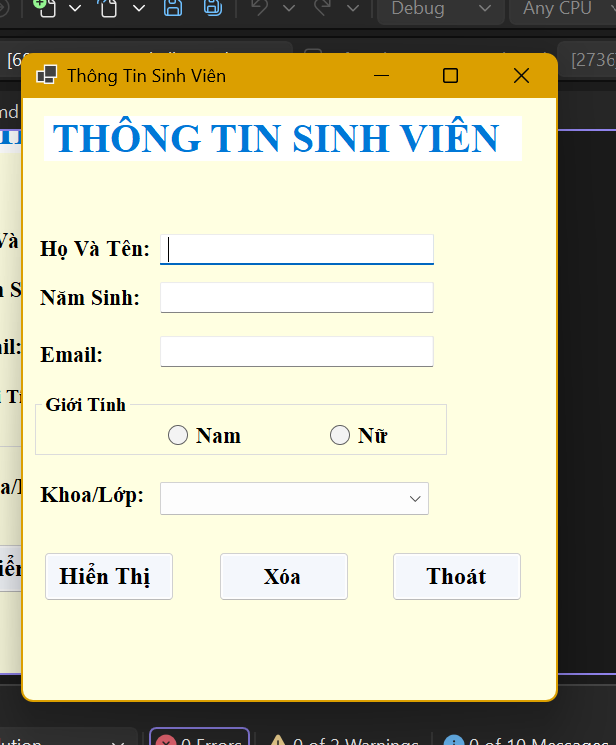
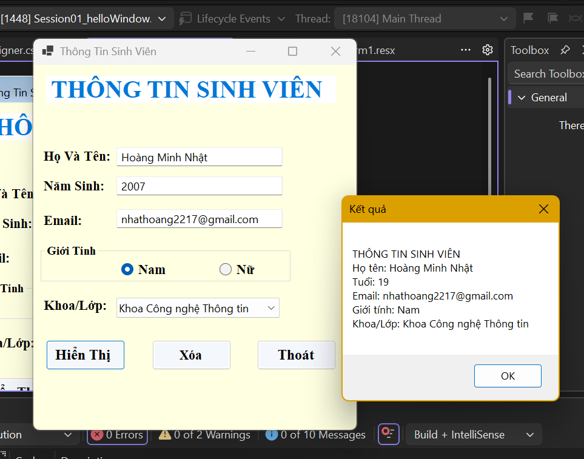
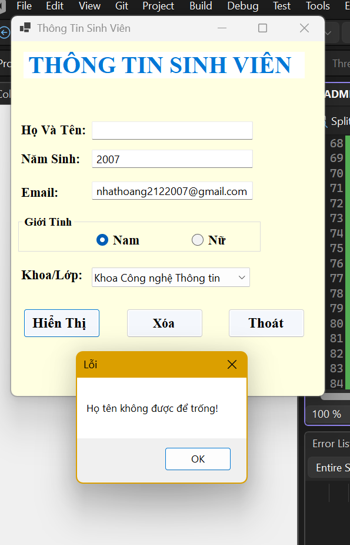
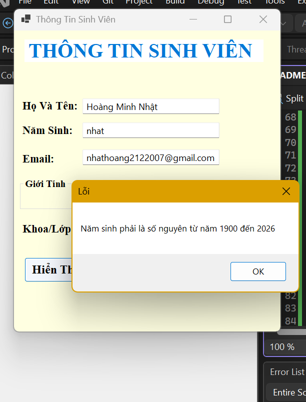
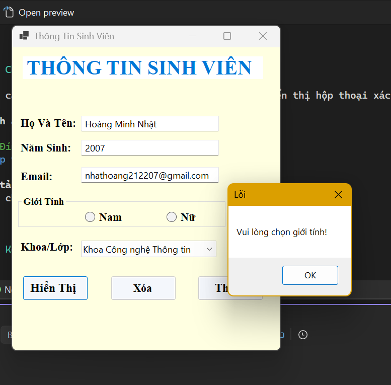
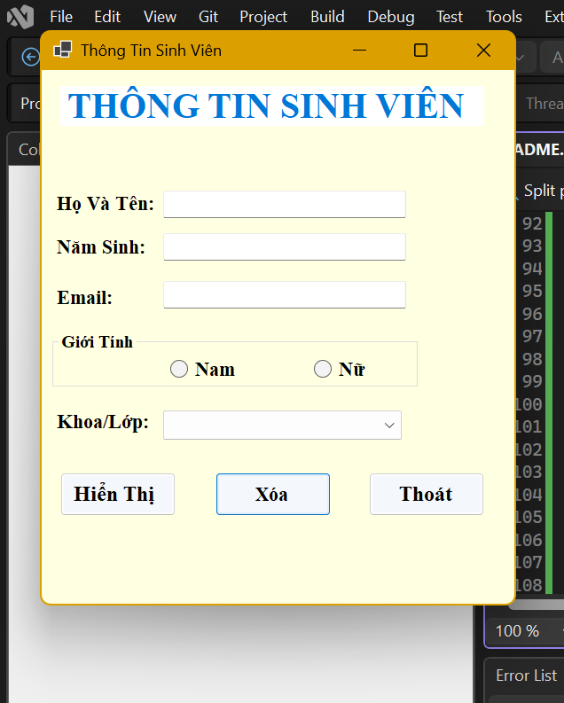
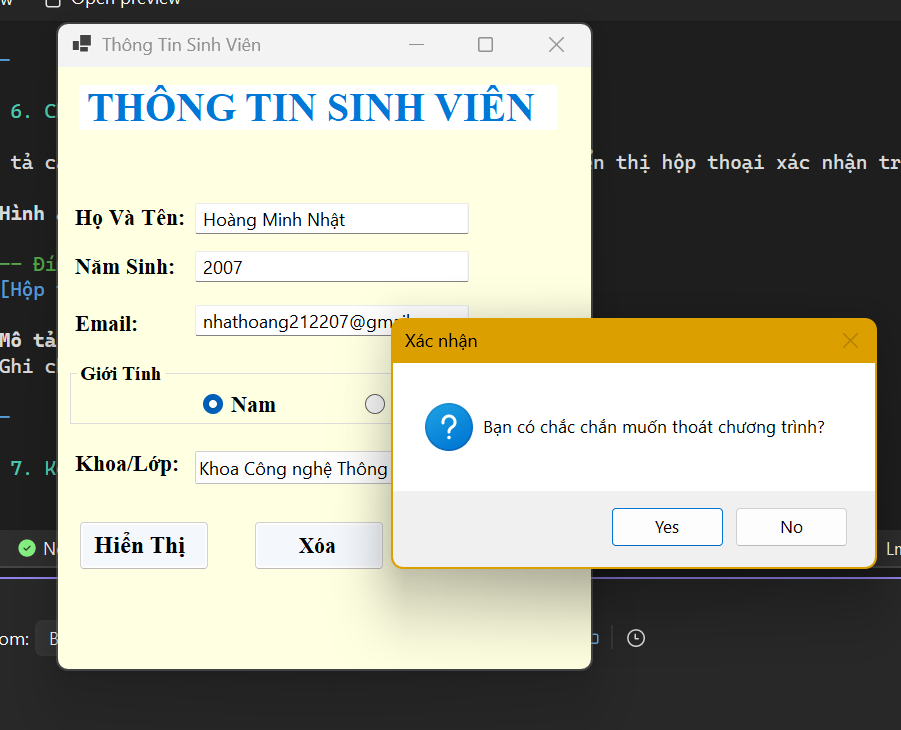

# BÁO CÁO KẾT QUẢ THỰC HÀNH LAB 01

## 2611COMP101904-Lap-trinh-Windows
## Bài Lab: Lab 01 - Ứng dụng Thông tin Cá nhân
## Họ tên sinh viên: Hoàng Minh Nhật
## MSSV: 51.01.104.066
## Nhóm 5

---

## 1. Giới thiệu bài toán

Ứng dụng Windows Forms cho phép nhập thông tin cá nhân của sinh viên (họ tên, năm sinh, email, giới tính, khoa/lớp) và hiển thị kết quả tổng hợp sau khi người dùng nhấn nút **Hiển thị**.

---

## 2. Thiết kế giao diện

Danh sách control đã sử dụng:

| STT | Control | Tên control | Chức năng |
|-----|---------|-------------|-----------|
| 1 | Label | lblTitle | Hiển thị tiêu đề chương trình |
| 2 | TextBox | txtHoTen | Nhập họ tên sinh viên |
| 3 | TextBox | txtNamSinh | Nhập năm sinh |
| 4 | TextBox | txtEmail | Nhập email |
| 5 | RadioButton | radNam, radNu | Chọn giới tính |
| 6 | ComboBox | cboKhoa | Chọn khoa hoặc lớp |
| 7 | Button | btnHienThi | Hiển thị thông tin |
| 8 | Button | btnXoa | Xóa dữ liệu đã nhập |
| 9 | Button | btnThoat | Thoát chương trình |
| 10 | Label/TextBox | lblKetQua/txtKetQua | Hiển thị kết quả tổng hợp |

**Hình ảnh giao diện Form (thiết kế lúc chưa nhập liệu):**

**Mô tả:**
> Ghi chú mô tả bố cục giao diện: các control được sắp xếp như thế nào, GroupBox nhóm giới tính, vị trí các nút lệnh...

---

## 3. Chức năng nút Hiển thị

Mô tả cách xử lý sự kiện Click của nút `btnHienThi`: kiểm tra dữ liệu hợp lệ, tính tuổi từ năm sinh, tổng hợp thông tin và hiển thị kết quả.

**Hình ảnh kết quả khi nhập dữ liệu hợp lệ và nhấn Hiển thị:**

<!-- Đính kèm hình ảnh tại đây -->

**Mô tả:**
> Ghi chú dữ liệu đã nhập (Họ tên, Năm sinh, Email, Giới tính, Khoa) và kết quả hiển thị tương ứng.

---

## 4. Kiểm tra dữ liệu đầu vào

Các điều kiện kiểm tra:
- Họ tên không được rỗng.
- Năm sinh không được rỗng và phải là số nguyên, nằm trong khoảng 1900 đến năm hiện tại.
- Email không được rỗng.
- Phải chọn giới tính.
- Phải chọn khoa hoặc lớp.

**Hình ảnh minh họa thông báo lỗi khi dữ liệu không hợp lệ (ví dụ: bỏ trống họ tên):**

<!-- Đính kèm hình ảnh tại đây -->

**Mô tả:**
> Ghi chú trường hợp lỗi được minh họa và nội dung thông báo MessageBox tương ứng.

**Hình ảnh minh họa thông báo lỗi năm sinh không hợp lệ:**

<!-- Đính kèm hình ảnh tại đây -->

**Mô tả:**
> Ghi chú trường hợp lỗi (năm sinh không phải số, hoặc ngoài khoảng 1900 - hiện tại) và thông báo tương ứng.

**Hình ảnh minh họa thông báo lỗi chưa chọn giới tính / khoa:**

<!-- Đính kèm hình ảnh tại đây -->

**Mô tả:**
> Ghi chú trường hợp lỗi được minh họa và nội dung thông báo tương ứng.

---

## 5. Chức năng nút Xóa

Mô tả cách xử lý sự kiện Click của nút `btnXoa`: đưa các TextBox về rỗng, bỏ chọn RadioButton giới tính, đưa ComboBox về lựa chọn đầu tiên hoặc không chọn.

**Hình ảnh trước và sau khi nhấn nút Xóa:**

<!-- Đính kèm hình ảnh tại đây -->

**Mô tả:**
> Ghi chú sự thay đổi của các control trước và sau khi nhấn nút Xóa.

---

## 6. Chức năng nút Thoát

Mô tả cách xử lý sự kiện Click của nút `btnThoat`: hiển thị hộp thoại xác nhận trước khi đóng chương trình (Yes/No).

**Hình ảnh hộp thoại xác nhận thoát chương trình:**

<!-- Đính kèm hình ảnh tại đây -->

**Mô tả:**
> Ghi chú nội dung hộp thoại xác nhận và chọn Yes/No.

---

## 7. Kết quả chạy chương trình 

