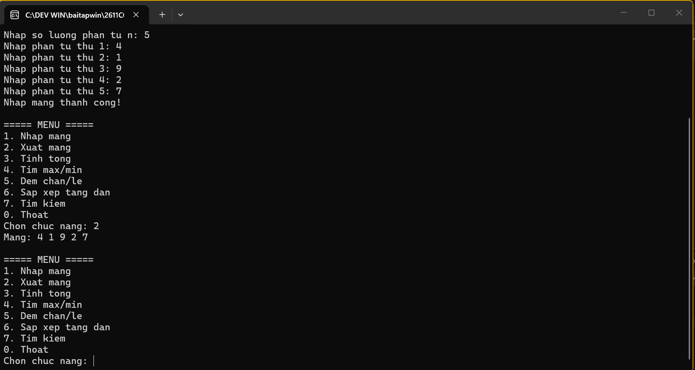
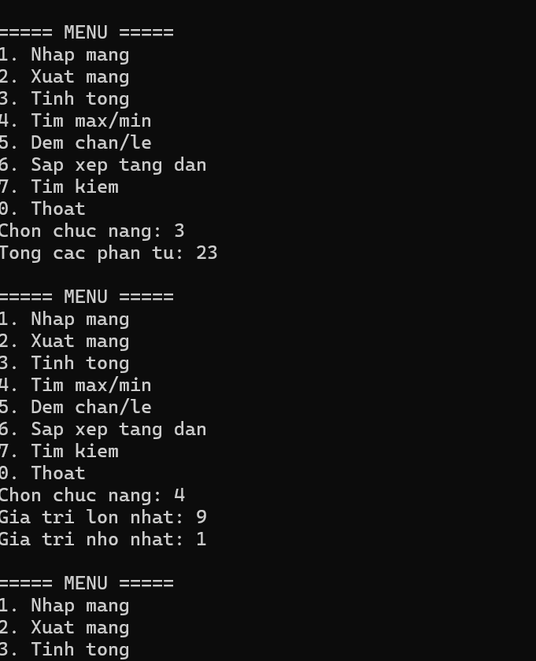
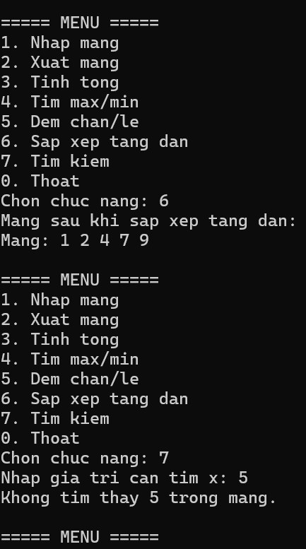
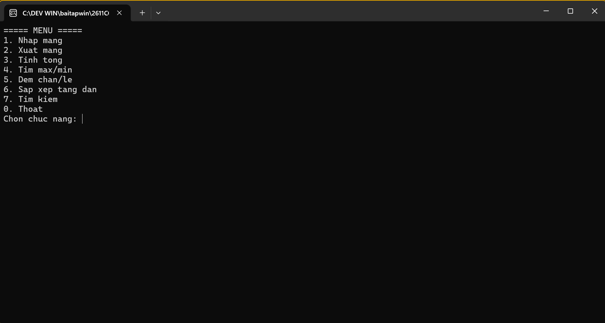

# Lab 02 - Quản lý mảng số nguyên bằng C# Console

2611COMP101904-Lap-trinh-Windows
Bài Lab: Lab 01 - Ứng dụng Thông tin Cá nhân
Họ tên sinh viên: Hoàng Minh Nhật
MSSV: 51.01.104.066
Nhóm 5

## 1. Mô tả bài toán

Chương trình Console cho phép người dùng quản lý một mảng số nguyên thông qua menu lựa chọn. Sau khi thực hiện xong một chức năng, chương trình quay lại menu cho đến khi người dùng chọn thoát.

## 2. Chức năng chương trình

| Lựa chọn | Chức năng | Mô tả |
|---|---|---|
| 1 | Nhập mảng | Nhập số lượng phần tử n (n phải là số nguyên dương), sau đó nhập n phần tử |
| 2 | Xuất mảng | In toàn bộ phần tử của mảng ra màn hình |
| 3 | Tính tổng | Tính và in tổng các phần tử trong mảng |
| 4 | Tìm lớn nhất và nhỏ nhất | In giá trị lớn nhất và nhỏ nhất trong mảng |
| 5 | Đếm chẵn/lẻ | Đếm số lượng phần tử chẵn và số lượng phần tử lẻ |
| 6 | Sắp xếp tăng dần | Sắp xếp mảng theo thứ tự tăng dần và in kết quả |
| 7 | Tìm kiếm | Nhập giá trị x, kiểm tra x có trong mảng không, nếu có in vị trí xuất hiện đầu tiên |
| 0 | Thoát | Kết thúc chương trình |

## 3. Cấu trúc chương trình

Chương trình được tách thành các phương thức nhỏ, mỗi phương thức đảm nhận một nhiệm vụ riêng:

- `HienThiMenu()` - hiển thị menu lựa chọn
- `NhapLuaChonMenu()` - đọc và kiểm tra lựa chọn menu người dùng nhập (không crash khi nhập sai)
- `KiemTraDaNhapMang()` - kiểm tra người dùng đã nhập mảng chưa trước khi cho xử lý các chức năng khác
- `NhapSoNguyen(string message)` - nhập một số nguyên bất kỳ, có kiểm tra định dạng
- `NhapSoNguyenDuong(string message)` - nhập một số nguyên dương, dùng cho số lượng phần tử n
- `NhapMang()` - nhập toàn bộ mảng
- `XuatMang(int[] a)` - in mảng ra màn hình
- `TinhTong(int[] a)` - tính tổng các phần tử
- `TimMax(int[] a)` / `TimMin(int[] a)` - tìm giá trị lớn nhất / nhỏ nhất
- `DemChan(int[] a)` / `DemLe(int[] a)` - đếm số phần tử chẵn / lẻ
- `SapXepTangDan(int[] a)` - sắp xếp mảng tăng dần bằng thuật toán Selection Sort
- `TimKiem(int[] a, int x)` - tìm kiếm tuần tự, trả về vị trí đầu tiên tìm thấy hoặc -1 nếu không có

## 4. Xử lý dữ liệu nhập

- Sử dụng `int.TryParse` để kiểm tra dữ liệu nhập, tránh chương trình dừng bất thường khi người dùng nhập sai định dạng (chữ, ký tự đặc biệt...).
- Số lượng phần tử n bắt buộc phải là số nguyên dương; nếu nhập 0 hoặc số âm, chương trình yêu cầu nhập lại.
- Các chức năng xử lý (2-7) chỉ được thực hiện sau khi người dùng đã nhập mảng ở chức năng 1.

## 5. Dữ liệu kiểm thử

| STT | Dữ liệu nhập | Kết quả cần kiểm tra |
|---|---|---|
| 1 | 5 phần tử: 4 1 9 2 7 | Tổng = 23, max = 9, min = 1, chẵn = 2, lẻ = 3 |
| 2 | 4 phần tử: -3 0 8 -1 | Tổng = 4, max = 8, min = -3, chẵn = 2, lẻ = 2 |
| 3 | Tìm x = 9 trong mảng 4 1 9 2 7 | Có tìm thấy, vị trí đầu tiên là 2 (tính từ 0) |
| 4 | Tìm x = 5 trong mảng 4 1 9 2 7 | Không tìm thấy |
| 5 | Nhập n = 0 hoặc n âm | Chương trình yêu cầu nhập lại |

## 7. Hình ảnh minh chứng

> Chèn ảnh chụp màn hình kết quả chạy thử chương trình vào đây 

